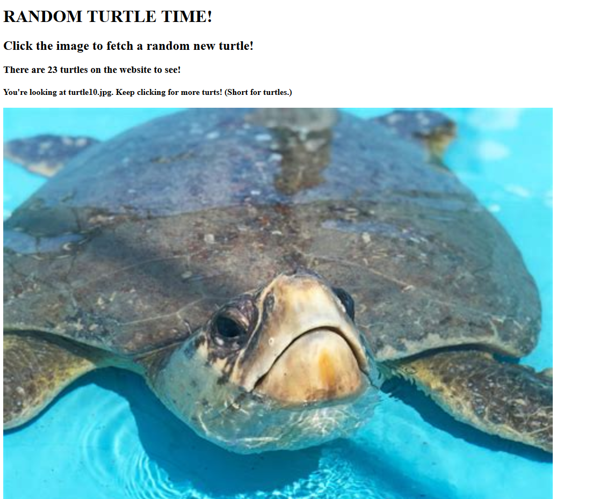

**RANDOM TURTLE TIME!**

This is my final project for Santa Monica College&#39;s CS79C class, Compute Engines In AWS.

It&#39;s a static website hosted from an S3 bucket that shows a picture of a turtle on the homepage. The user can click the picture and it will change to a picture of a different random turtle using S3, DynamoDB, Lambda, and API Gateway.

**AWS S3:**

I created a bucket to store the static website files.

**Index.html** – This is the main HTML page.

**main.js** – This is the main JavaScript file. It contains two functions:

**1) getNewTurtle()** – When the user clicks the picture of a turtle, it calls this function which hits an AWS Lambda function called **lambdaDynamoRead** via an API Gateway GET request. The Lambda function reads the S3 file **turtlecount.txt** , which holds a number representing the number of turtles stored in the S3 bucket. (It knows this number because the turtles are named in ascending order: turtle1.jpg, turtle2.jpg, etc. Whenever another turtle is added to the S3 bucket, a different Lambda function writes the new highest number back to **turtlecount.txt.** ) **lambdaDynamoRead** then calculates a random number between 1 and the highest number of turtles, then pulls that turtle from DynamoDB and sends the information back to the website, which updates the image of the turtle and the name of the turtle currently being displayed.

**2) updateCount() –** This function calls the Lambda function **lambdaReadBucketFile** via an API Gateway GET request. That Lambda function reads the **turtlecount.txt** file and returns the number to the website, which updates the line displaying how many turtles are in the database. This happens whenever the website is loaded, in case turtles have been added since the last time it was viewed.

**turtlecount.txt** – This text file holds the current count of the number of turtle pictures stored in the S3 bucket. It is updated whenever a new turtle picture is uploaded. It is read on page load to show the user how many turtles are in the database.

**AWS DynamoDB:**

I created a table called **ddbFinalProject.** The image files of turtles are stored in the S3 bucket, but I wanted the website to quickly be able to pull a random turtle from the database when a user clicked on the picture. I wasn&#39;t sure how to randomly pull a file from an S3 bucket, but I knew if I transferred the information to a DynamoDB table, I could do some random number generation and pull a random entry that way.

I wrote a Lambda function **lambdaReadS3ImageToDynamoDB** which had an S3 Object Creation trigger. It stored every S3 jpg file as an entry in the DynamoDB table with the attributes **url** (constructed from the objects name and bucket URL), **name** (the same as the object&#39;s name), and **id** (the number of the turtle). This way, I could access the turtles&#39; information easily in order to update the website dynamically. The website can change the image of the turtle, the name of the turtle, and the total number of turtles in the database.

**AWS Lambda:**

I used three Lambda functions in this project.

**lambdaReadS3ImageToDynamoDB** – This Lambda triggers off every new S3 .jpg file added to my bucket. It copied the information into a DynamoDB table. I limited the trigger to .jpg files because the **turtlecount.txt** file is constantly being read and written to. I wanted to avoid any bugs with Lambdas running during those changes to the S3 bucket.

**lambdaDynamoRead –** This Lambda triggers off an API Gateway GET request. It reads the **turtlecount.txt** file to get the number of turtles in the database. It calculates a random turtle, fetches that turtle&#39;s information from DynamoDB, and returns the information to the website.

**lambdaReadBucketFile** – This Lambda triggers off an API Gateway GET request. It reads the **turtlecount.txt** file and returns the number of turtles in the database to the website.

**AWS API Gateway:**

Since the site is statically hosted on an S3 bucket, I only needed two API Gateway endpoints. One occurs when the website is first loaded, to calculate the number of turtles. The other occurs whenever the turtle picture is clicked and results in a new turtle picture being shown.

**Next Steps:**

I originally wanted to have a file upload button so that users could upload their own turtle images that are automatically added to the S3 bucket and DynamoDB database. Unfortunately, I struggled trying to figure out how to authenticate direct uploads to S3 from an HTML page. This next step would improve the user experience and allow everyone to see more turtles!

**Things I Learned:**

It took me several days to get Lambda functions working with API Gateway. I kept hitting error messages like &quot;Internal Server Error&quot; and &quot;Missing Authentication&quot;. I learned that Lambda functions must return an object with a **statusCode** in order to trigger correctly off an API Gateway. The AWS documentation was not particularly helpful here. I only found one page that mentioned this necessity.

I also ended up turning off the &quot;Enable CORS&quot; setting in API Gateway because I kept getting errors. My workaround was to individually set the &quot;Access-Control-Allow-Origin&quot; header in the &quot;Method Response&quot; and &quot;Integration Response&quot; endpoints. There must be something I was doing wrong, but again, the AWS documentation was not very helpful and I figured out this workaround by trial and error.

After all is said and done, I put together a website that dynamically calls AWS services to update data in a DynamoDB table, rewrite a text file in an S3 bucket, and serve new data to the website. And it&#39;s got turtles!

**Screenshots:**

**Website: Main Page**

This is the main page. It shows the number of turtles in the database (this is calculated when the page loads) as well as the turtle&#39;s name. In this case, it is just the homepage turtle.

Here is the website after clicking the picture of the turtle. The name has updated to reflect it is showing turtle10.jpg.

**S3 Bucket:**

Here is the S3 bucket page showing some of the files stored there.

**DynamoDB:**

Here is a picture of some of the items in the DynamoDB table. The three pieces of data it holds are a picture&#39;s URL, id, and name.

**lambdaReadS3ImageToDynamoDB:**

Here is the full code for the function.

**lambdaDynamoRead:**

Here is the actual code for the lambdaDynamoRead function.

**lambdaReadBucketFile:**

Here is the full code for the function.

**HTML and JavaScript code:**

Here is the HTML for the webpage.

Here is the JavaScript code.
